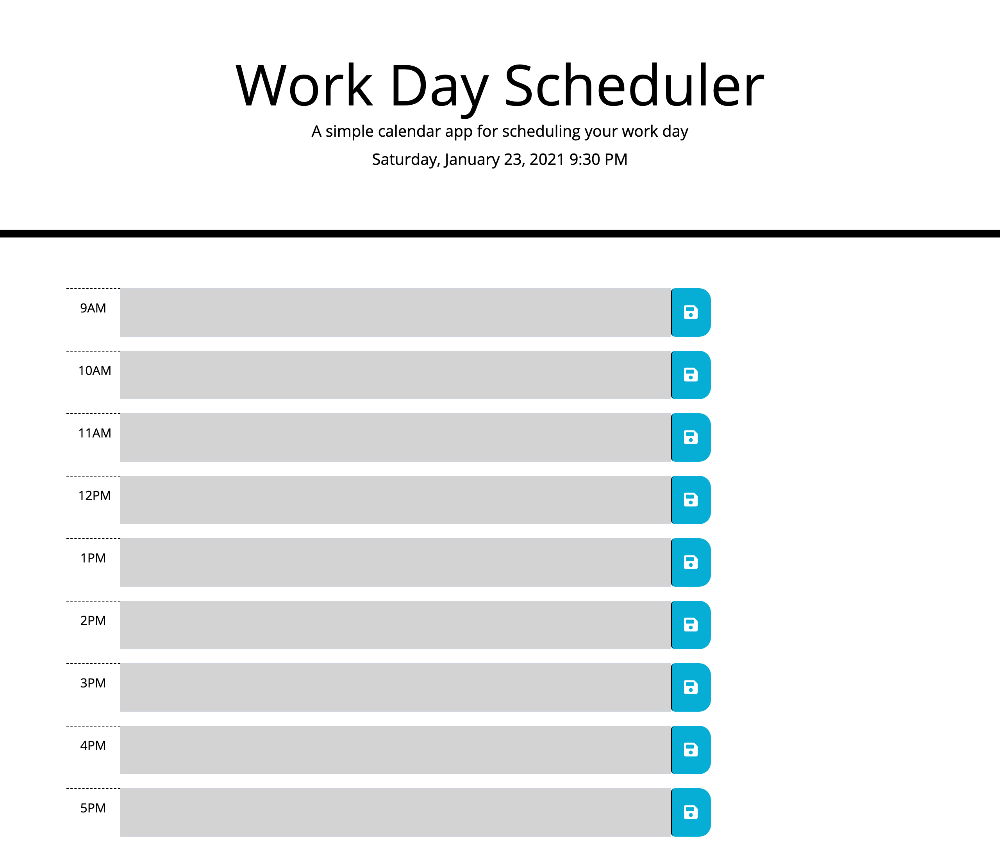

# Hows-My-Day

## Task
We were tasked with creating a work day planner web appplication that can save text to local storage when the save button is clicked. The text area should also dynamically change colors based on the time of day.

## Thoughts
This was a pretty good HW. It showed me I know a lot more than I think, but still need to study more. It's a lot more difficult to dynamically change the color with the way I structured my code, but it allows me to think critically.

